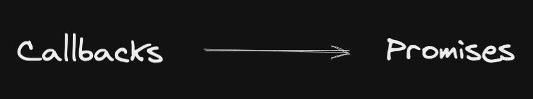

Coming back to the topic of asynchronous JavaScript. Let's figure out what promises are and how to use them.

In the last part I described the way the callbacks work and used to help
developers use asynchronous methods in JavaScript. This time, I will have a
closer look at the next step in the hierarchy: promises.

